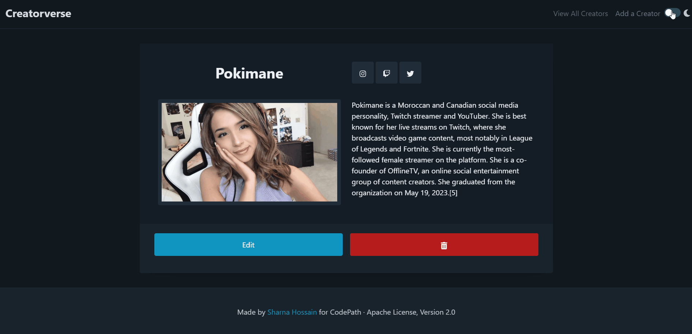

# WEB103 Prework - *Creatorverse*

Submitted by: **Sharna Jahan Hossain**

About this web app: **👉🏿 app description here**

Time spent: **~30 hours (started 6/6)**

## Required Features

The following **required** functionality is completed:

<!-- 👉🏿👉🏿👉🏿 Make sure to check off completed functionality below -->
- ✅ **A logical component structure in React is used to create the frontend of the app**
- ✅ **At least five content creators are displayed on the homepage of the app**
- ✅ **Each content creator item includes their name, a link to their channel/page, and a short description of their content**
- ✅ **API calls use the async/await design pattern via Axios or fetch()**
- ✅ **Clicking on a content creator item takes the user to their details page, which includes their name, url, and description**
- ✅ **Each content creator has their own unique URL**
- ✅ **The user can edit a content creator to change their name, url, or description**
- ✅ **The user can delete a content creator**
- ✅ **The user can add a new content creator by entering a name, url, or description and then it is displayed on the homepage**

The following **optional** features are implemented:

- ✅ Picocss is used to style HTML elements
- ✅ The content creator items are displayed in a creative format, like cards instead of a list
- ✅ An image of each content creator is shown on their content creator card

The following **additional** features are implemented:

* ✅ **Dynamic Light and Dark Themes** utilizing Pico.css variables, managed with React's state management.

* ✅ **Robust form validation with intuitive UI feedback** to ensure that only valid data is submitted to the database, promoting data integrity and user experience. The form checks whether the user has submitted the required information (name, description, and at least one social media link).
* ✅ **Responsive Web Design.** My project features a fixed Navbar positioned at the top. To achieve this layout, I utilized React's useRef() hook to dynamically calculate the Navbar's height, which varies based on Pico.css's responsiveness. This calculation allowed me to offset the body content, ensuring it appears directly beneath the Navbar, providing a visually harmonious and user-friendly browsing experience.
* ✅ **Refresh creators every render of homepage to fetch most recent changes.** The first fetch to View All Content Creators occurs in App.js, which renders only once per refresh. However, to achieve real-time data updates, I positioned a component slightly further down the component tree to handle data refreshes, enabling the continuous fetching of new data and seamless display of up-to-date content to the users.
* ✅ **Implemented React's ContextAPI to effectively manage the data fetched from Supabase.** Using ContextAPI, I established a streamlined flow of data throughout the component tree structure, promoting a cleaner and more organized data management approach. This not only facilitates better data accessibility but also mitigates redundant API calls, preventing unnecessary rerenders.
* ✅ **Loading pages during API calls.** Users are presented with visual feedback, a loading spinner, while waiting for data to be fetched from the API. Additionally, I integrated error pages to gracefully handle scenarios where API requests fail or no data is available. For example, when the user tries to visit the url "/view/x" where *x* is the ID of a creator that does not exist.

* ✅ **Modal to confirm the deletion of a creator.** When a user initiates the deletion action, the Modal dialog appears, prompting them to confirm their decision. 
* ✅ **[React Icons Library](https://react-icons.github.io/react-icons/) for icon assets.** I leveraged the library to incorporate a wide range of visually appealing and scalable icons. 

## Video Walkthrough

Here's a walkthrough of implemented required features:

👉🏿

<!-- Replace this with whatever GIF tool you used! -->
GIF created with ...  👉🏿 GIF tool here
<!-- Recommended tools:
[Kap](https://getkap.co/) for macOS
[ScreenToGif](https://www.screentogif.com/) for Windows
[peek](https://github.com/phw/peek) for Linux. -->

## Notes

Describe any challenges encountered while building the app or any additional context you'd like to add.

## License

Copyright 2023 Sharna Hossain

Licensed under the Apache License, Version 2.0 (the "License"); you may not use this file except in compliance with the License. You may obtain a copy of the License at

> http://www.apache.org/licenses/LICENSE-2.0

Unless required by applicable law or agreed to in writing, software distributed under the License is distributed on an "AS IS" BASIS, WITHOUT WARRANTIES OR CONDITIONS OF ANY KIND, either express or implied. See the License for the specific language governing permissions and limitations under the License.
